# Easily Build a Custom Language Analysis Model with Watson Knowledge Studio & NLU


## Workshop Resources

- Login/Sign Up for [IBM Cloud](https://ibm.biz/WKS_NLU)
  
- [Hands-On Guide](https://developer.ibm.com/tutorials/build-a-recommendation-engine-with-watson-natural-language-understanding/)

- Slides: <Link>

- Workshop Replay: <Link>
  
- Survey [Here](https://ibm.biz/WKSNLUSurvey)  

## Table of Contents
1. [Prerequisites](#Prerequisites)
1. [CodeLab](#CodeLab)  
  
## Prerequisites
  
**Sign-up/Login to IBM Cloud**

If you are an existing user please [login to IBM Cloud](https://ibm.biz/WKS_NLU)

And if you are not, don't worry! We have got you covered! There are 3 steps to create your account on [IBM Cloud](https://ibm.biz/WKS_NLU): <br>
1- Put your email and password. <br>
2- You get a verification link with the registered email to verify your account. <br>
3- Fill the personal information fields. <br>
** Please make sure you select the country you are in when asked at any step of the registration process.
  


## CodeLab

IBM&reg; Watson&trade; Knowledge Studio is a service that lets you create a customized language analysis model for a specific domain. This is especially useful for specialized industries with complex languages such as medicine, law, and finance.

In this tutorial, learn how to use Watson Knowledge Studio to annotate reviews for auto repair facilities. After annotating the reviews, you can then train a machine learning model that can analyze the reviews. The model is able to determine what types of repairs were needed by the vehicle and how satisfied the customer was with the quality of work. By analyzing the reviews associated with a given auto repair shop, you can generate insights about that shop's overall performance to determine what types of repairs they're most (and least) skilled at.


To follow this tutorial, you need an IBM Cloud account. If you don't have one, you can [create one](https://ibm.biz/WKS_NLU).

### Provision a Watson Natural Language Understanding instance

After you have an IBM Cloud account, navigate to the main Dashboard

1. Click **Catalog**.
1. Search for **Natural Language Understanding**, and click the icon when it appears.

    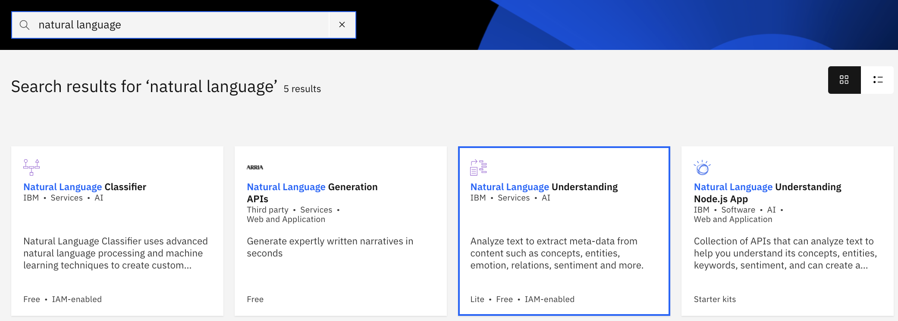

1. Select a pricing plan for the  Watson Natural Language Understanding service, and click **Create**.

    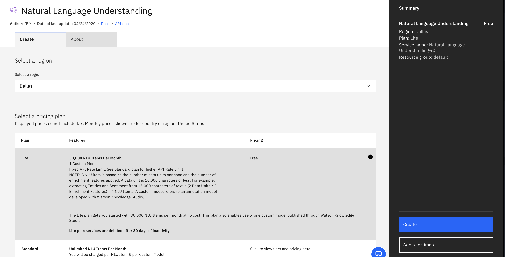

After the service is provisioned, store the API key and URL. These credentials are needed later in the tutorial.

### Provision a Watson Knowledge Studio instance

To provision an IBM Watson Knowledge Studio instance:

1. Click **Catalog**.
1. Search for **Knowledge Studio**, and click the icon the icon when it appears.

    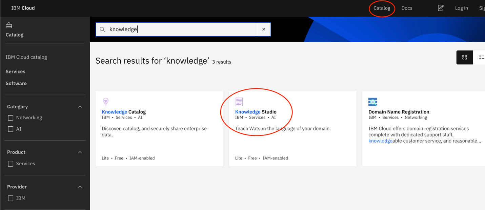

1. Select a pricing plan ("Lite" is sufficient here), and then click **Create**.

    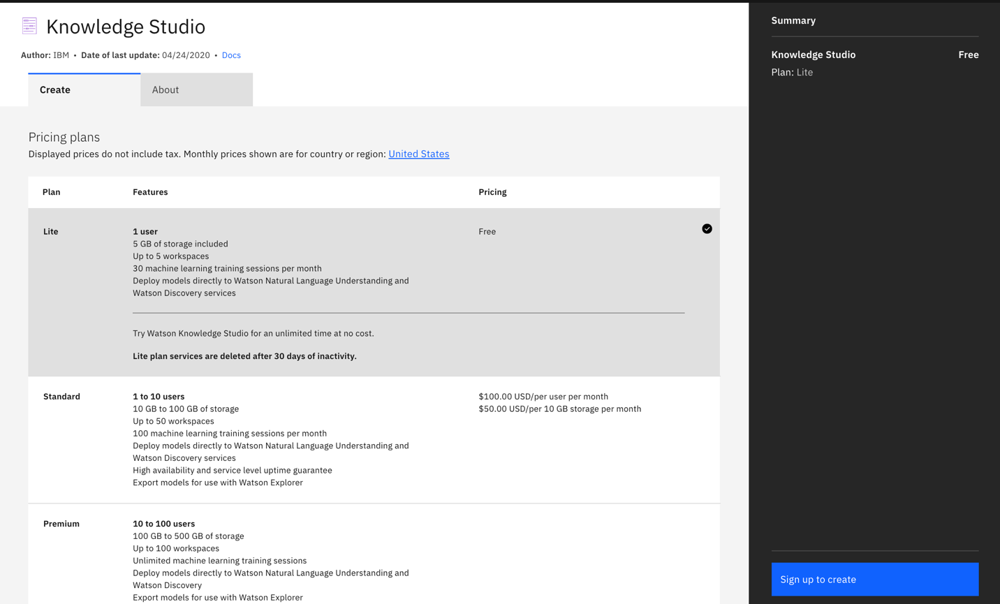

1. Click **Launch Watson Knowledge Studio** after the service is provisioned.

    

### Estimated time

It should take you approximately 60 minutes to complete the tutorial after you've completed the prerequisites.

### Steps

1. [Define entity types and subtypes](define-entities-and-entity-subtypes)
2. [Create "Relation Types"](create-relation-types)
3. [Collect documents that describe your domain language](collect-documents-that-describe-your-domain-language)
4. [Annotate Documents](annotate-documents)
5. [Generate a Machine Learning Model](generate-a-machine-learning-model)
6. [Deploy model to Natural Language Understanding service](deploy-model-to-natural-language-understanding-service)

### Define entities and entity subtypes

Begin by creating Entity Types. An entity is a representation of an object or concept. In this case, you'll create entities related to auto repairs such as a *Mechanic*, *Vehicle*, and *Repair*. First, you'll create a *Repair* entity, which describes the problem that the vehicle was serviced for.

1. Click **Entity Types** in the left menu.

1. Click **Add Entity Type**.

    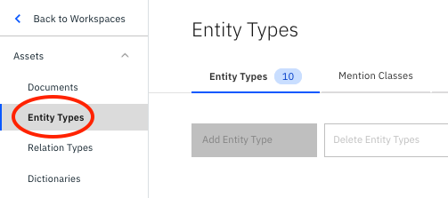

1. Label the new entity as a *Repair*.

1. Add subtypes, which let you further classify an entity instance. For example, a reference to an alternator or spark plug can be labeled as an *Electrical* subtype of the *Repair* entity.

    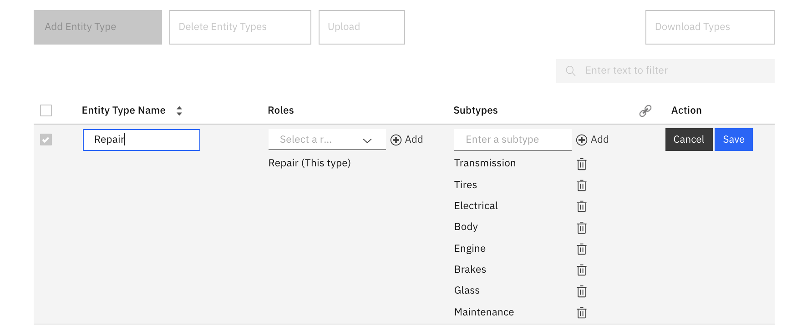

Now that you understand how to create entities, you can upload a preconfigured list of entity types. Download the [JSON types](https://github.com/IBM/virtual-insurance-assistant/blob/master/data/wks/types-8c501370-8411-11ea-9a22-cf86d29dec48.json), then click **Upload**.

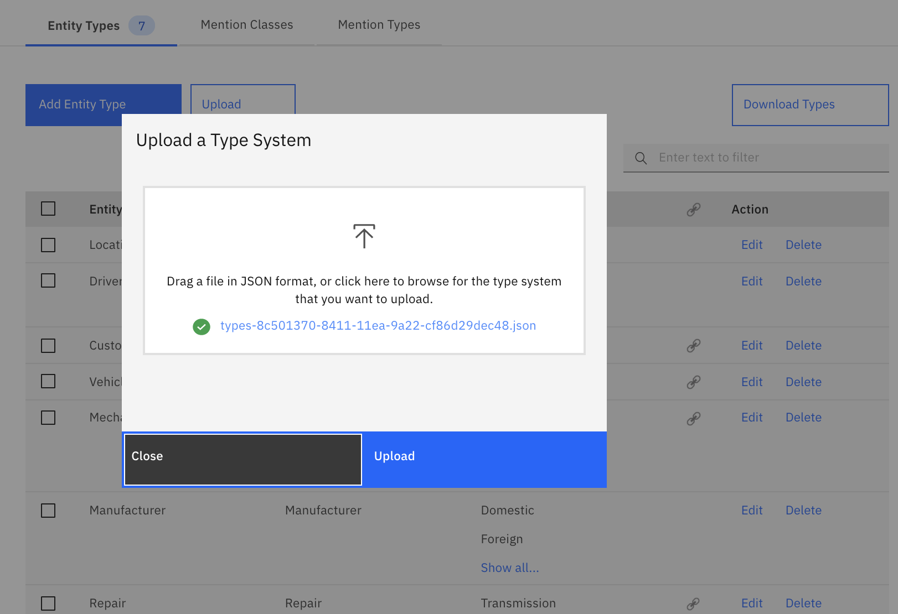

After uploading and creating the entity types, click **Save**.

### Create Relation Types

Relation Types describe how two entities are associated. For example, if you have a *Vehicle*, *Customer*, and *Mechanic*, the vehicle might have an *OwnedBy* relation with the customer and a *RepairedBy* relation with the mechanic.

1. Create relations by clicking **Relation Types** in the menu.

1. Click **Add Relation Types**.

1. Name the relation type, and list the valid entity pairs that can have that relation.

    There should be a set of relation types already uploaded from the previous step. Examples in this case can be:

    * RepairedBy (*Vehicle* can be repaired by a *Mechanic*)
    * OwnedBy (*Vehicle* can be owned by a *Driver*)
    * DamagedBy (*Vehicle* can be damaged by a *Driver* or *Mechanic*)

    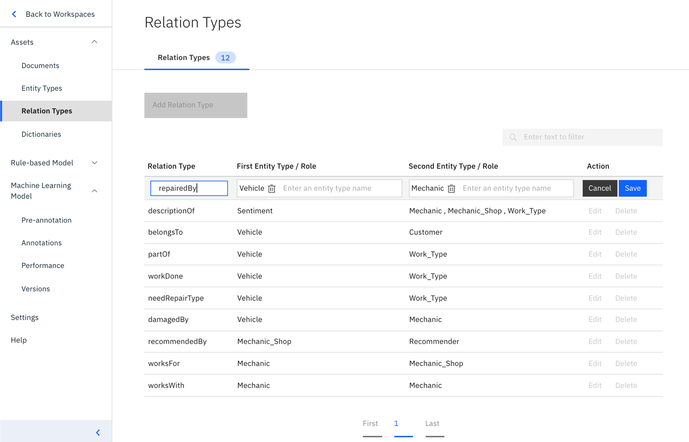

### Collect documents that describe your domain language

Collect files that contain text examples that describe automobile damage and repairs. These examples let Watson Knowledge Studio learn the relevant *domain language*, which consists of terms and phrases that are commonly used by auto mechanics. In this example, we use customer reviews that describe experiences with various mechanics.

We have included a set of pre-annotated synthetic reviews to get started, which you can [download](https://github.com/IBM/virtual-insurance-assistant/blob/master/data/wks/corpus-e6e25540-9c54-11ea-b92e-afac3e68cacf.zip).

If you want to train a data model with some actual survey data, you can use the [Yelp data set](https://www.kaggle.com/c/yelp-recruiting/data), which you can access subject to the Yelp Terms of Use. This data set has a JSON file that includes millions of reviews of auto mechanic shops around the United States. Each review must be placed into individual .txt files.

After collecting the documents, they'll need to be uploaded to Watson Knowledge Studio. Log in to your Watson Knowledge Studio instance, and click **Documents**.

1. Click **Upload Document Sets**.

    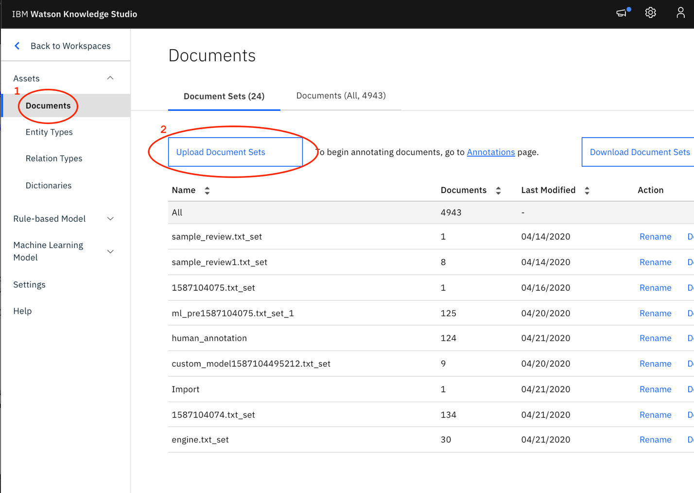

1. Upload your documents by dragging them to the **Add a Document Set** section.

    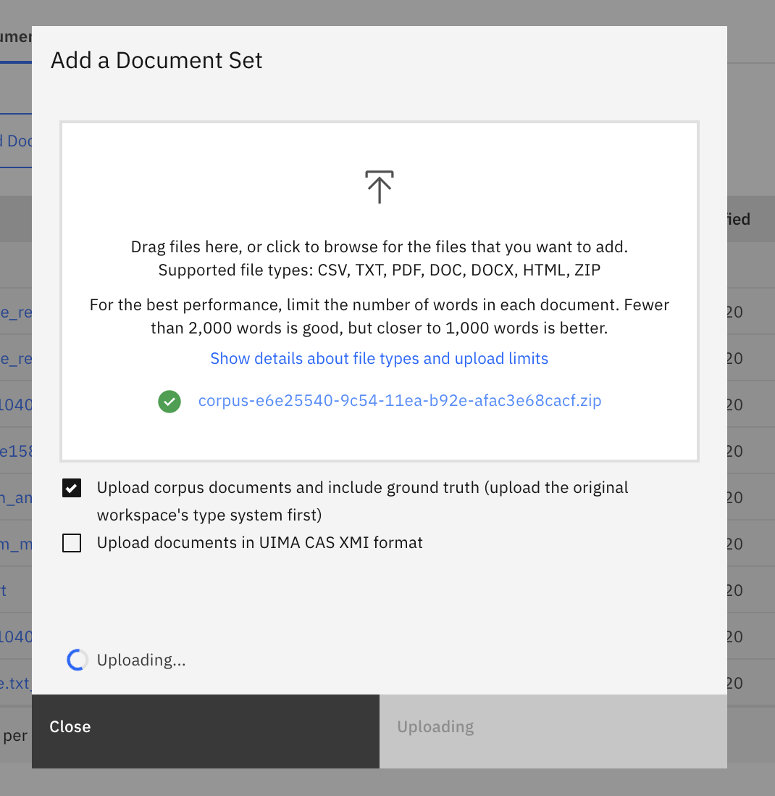

### Annotate documents

After creating the Entity and Relation Types, you can add the annotation, which maps each document's words and phrases to your defined entities.

1. Click **Machine Learning Model**, then **Annotations**.

    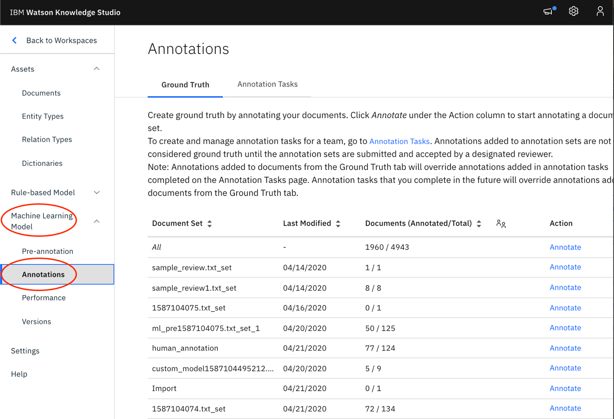

1. Locate the Document set that you uploaded earlier, and click **Annotate**.

    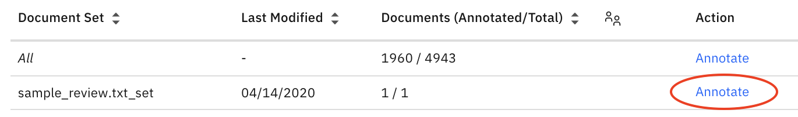

1. Begin annotating all mentions in the document that reference a defined Entity by selecting each relevant word or phrase.

1. Click the corresponding Entity Type in the menu on the right.

    We apply the following annotations in the image.

    * *SUVs* and *Motorcycles* can be labeled as a *Vehicle* and sub entity *Type*.
    * *Glass Repair* and *Body Work* can be labeled as the *Repair* entity and *Glass* / *Body* subtype.
    * *Joe's Auto Repair*, *Joe*, *Lydia*, and *they* refer to the mechanics.

    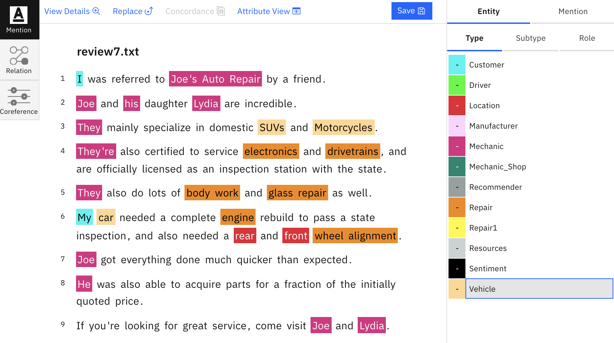

1. Define the relationships between entities by clicking **Relation**, which is shown in black in the following image.

    In this example, *My* is a reference to the customer or reviewer. *Car* is owned by the customer, so it is labeled as a *Vehicle* entity and has the *belongsTo* relation with the customer. The mention *suspension* has the *Repair* entity and has a *needsRepairType* relationship with the car.

    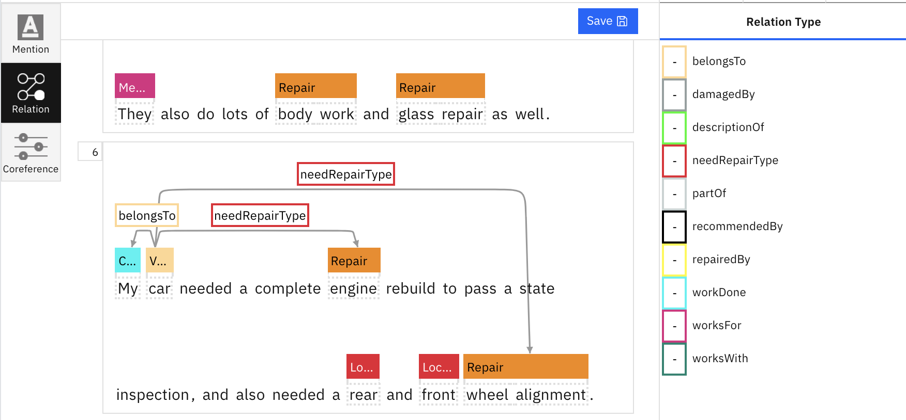

1. Add coreferences, which occur when there are multiple different mentions that reference the same entity. In this case, *Joe*, *his*, and *he* all refer to the same *Mechanic* entity. To bind them together, select **Coreference**, and click each reference. Then, double-click the last entity mention to apply the coreference.

    After this is successfully applied, a small number should appear under each coreference.

    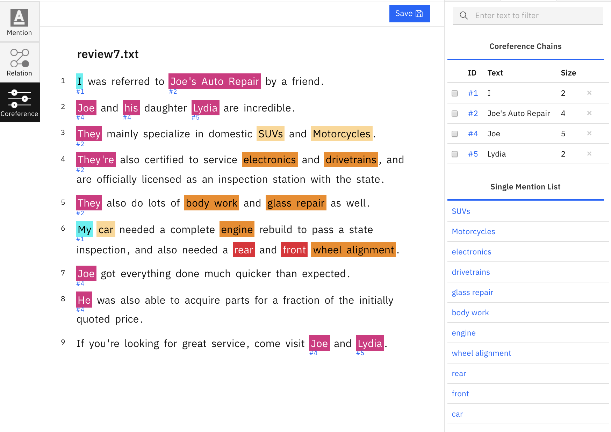

### Generate a machine learning model

After annotating a few documents, you can train a machine learning model that annotates the remaining unlabeled documents. This model can also be exposed through an API, which we show in the next step.

1. Create the model by selecting **Performance**.

1. Click **Train and evaluate**.

    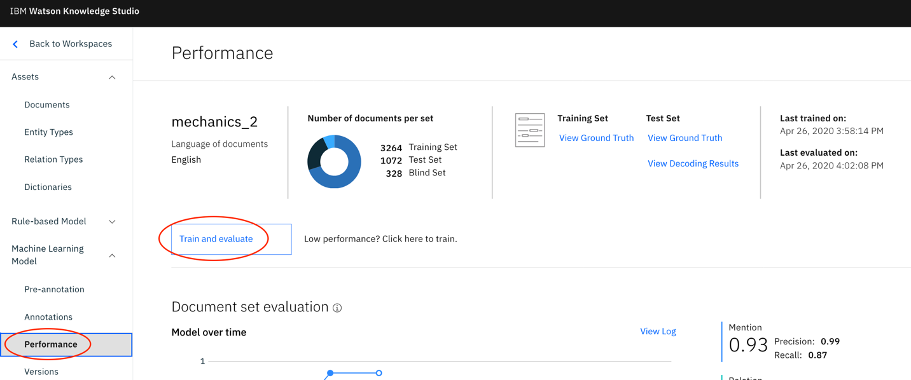

1. Click **Edit Settings** if you would like to select specific document sets to train on, or adjust your Test, Training, and Blind training subsets.

    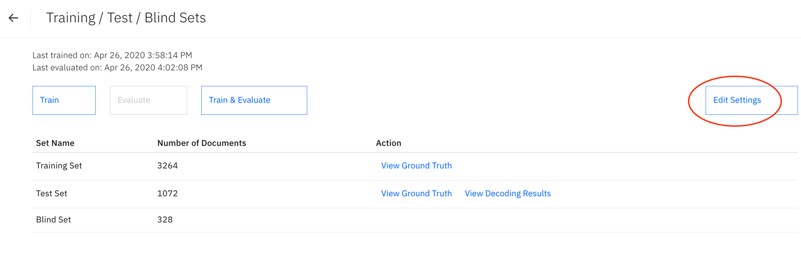

1. Confirm your training settings, and click **Train & Evaluate**.

    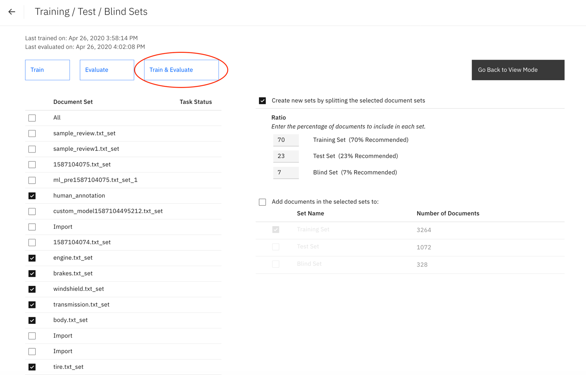

After training is complete, you can deploy your custom machine learning model to the Watson Natural Language Understanding service. This deployment makes your custom machine learning model through an API.

1. Click **Versions** to view your trained models, then click **Deploy**.

    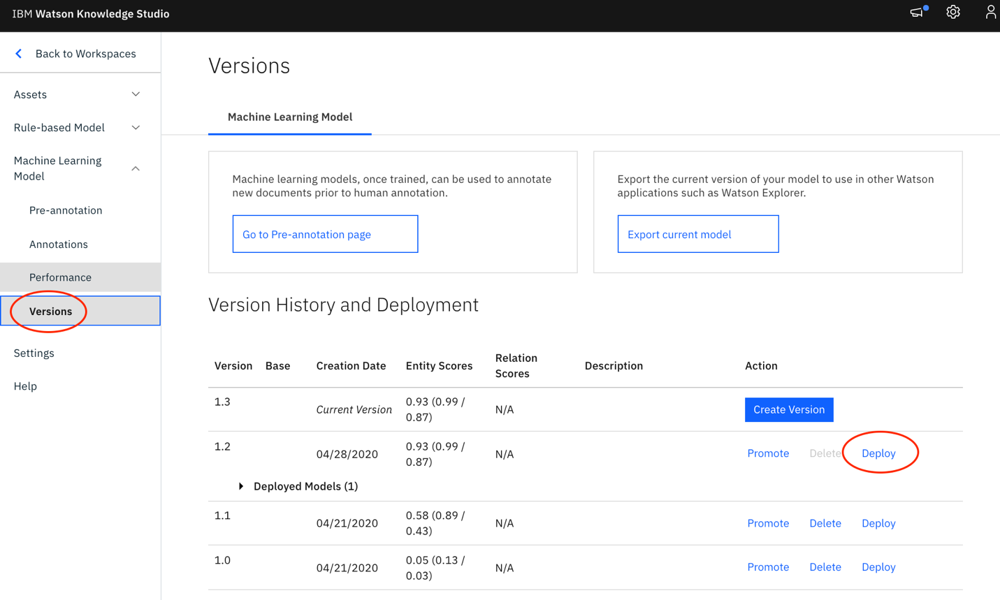

1. Select **Natural Language Understanding**, and click **Next**.

    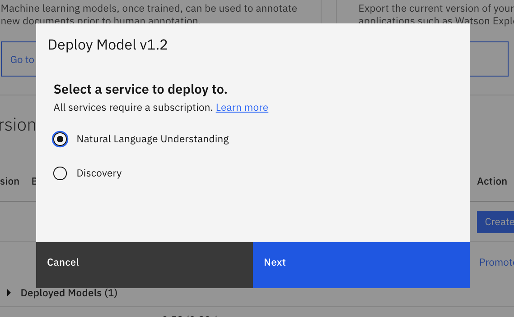

1. Select your Region, Resource Group, and Service Name, and click **Deploy**.

After the deployment is finished, you should see a new entry in the Deployed Models list. Expand it to get your Model ID.

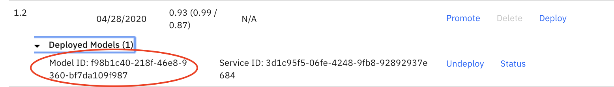

### Deploy model to Watson Natural Language Understanding

Now, you should be able to test the model by POSTing data to an API. To do so, you need the following credentials.

* The Natural Language Understanding API Key
* The Natural Language Understanding URL
* The Watson Knowledge Studio Deployed Model ID (taken from the end of the previous section)

The Natural Language Understanding API Key and URL can be found by navigating to your Watson Natural Language Understanding instance page and looking in the Credentials section.

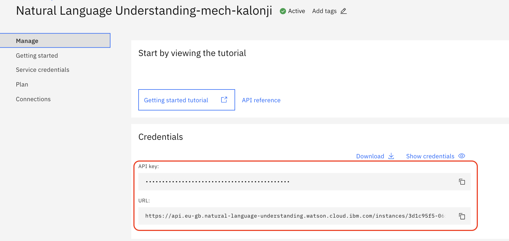

Create a .json file using the following code. In your file, replace the `model_id` with the deployment ID generated from Watson Knowledge Studio. Also, insert the following text in the `<input text>` section: **My truck windshield was cracked, so I went to Joe's Auto shop and they replaced it for me. They did an excellent job. I would highly recommend them**.

```
{
  "text": "<input_text>",
  "features": {
    "entities": {
      "model": "<model_id>"
    },
    "keywords": {
      "emotion": true,
      "sentiment": true
    },
    "emotion": {
        "sentiment": true
    },
    "categories": {
      "sentiment": true
    },
    "relations": {
      "model": "<model_id>"
    },
    "sentiment": {}
  }
}
```

Run a curl command to analyze the text with the generated machine learning model. Be sure to update the `nluApiKey` and `nluUrl` fields with your service credentials. Also, add the path to your .json file.

```
curl -X POST -H "Content-Type: application/json" -u "apikey:{apikey}" -d @parameters.json "{url}/v1/analyze?version=2021-08-01"

```

In the sentiment section, you see that the review was labeled as positive. And in the entities section, you'll be able to recognize which repairs were completed.

```
"sentiment": {
  "document": {
    "score": 0.952598,
    "label": "positive"
  }
},
```

```
"entities": [
  {
    "type": "Repair",
    "text": "windshield",
    "disambiguation": {
      "subtype": [
        "Glass"
      ]
    },
    "count": 1,
    "confidence": 0.994622
  },
```

### Conclusion

In this tutorial, you learned how to annotate a set of documents to accurately classify reviews. In the [accompanying pattern](/patterns/build-a-virtual-insurance-assistant-to-process-insurance-claims/), you'll see how to aggregate the natural language understanding results for each mechanic and determine the best mechanic for a given repair type. This tutorial is part of the [Build a customer care solution](/articles/insurance-industry-customer-care-solution) to help your customers manage their insurance claims and get automobile service information.


## Workshop Resources

- Login/Sign Up for [IBM Cloud](https://ibm.biz/WKS_NLU)

- Hands-On Guide: <Link>

- Slides: <Link>

- Workshop Replay: <Link>
  
- Survey [Here](https://ibm.biz/WKSNLUSurvey)
  
## References
Watson NLU [Demo](https://www.ibm.com/demos/live/natural-language-understanding/self-service/home)   
Watson Knowledge Stdudio [Demo](https://www.ibm.com/demos/live/watson-knowledge-studio/self-service/home)  

  
## Done with the workshop? Here are some things you can try further
- [Build a customer care solution](/articles/insurance-industry-customer-care-solution)


